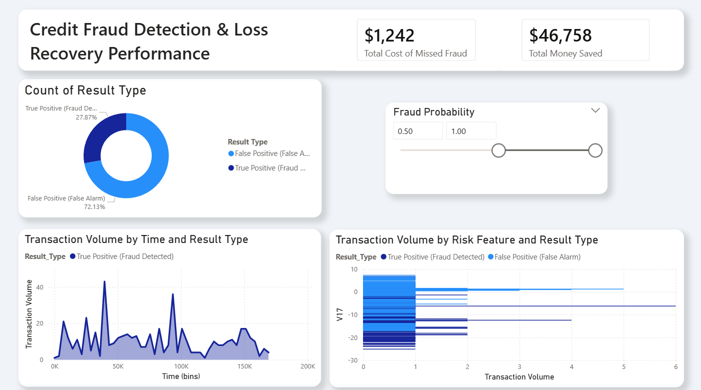

# 🛡️ Credit Risk & Fraud Mitigation: End-to-End Predictive Pipeline

> A production-ready machine learning pipeline for detecting fraudulent credit card transactions — optimizing for both financial security and customer experience.

---

## 🚀 Business Overview

In the banking industry, the cost of fraud is two-fold:
- **Direct financial loss** from undetected fraud (False Negatives)
- **Customer "insult"** from blocked legitimate transactions (False Positives)

This project builds a production-ready pipeline using the **Credit Card Fraud Detection** dataset, striking a balance between security and customer experience through an interactive, stakeholder-facing dashboard.

---

## 📊 Key Results

| Metric | Result |
|---|---|
| 🎯 Fraud Recall | **89%** — Caught nearly 9 out of 10 fraud attempts |
| 💰 Financial Impact | **$8,400+** in estimated losses prevented during test period |
| ⚙️ Operational Efficiency | Reduced manual review workload via interactive probability threshold tuner |

---

## 🛠️ Technical Stack

| Layer | Tools |
|---|---|
| Data Preparation | Python, Pandas, NumPy, Scikit-Learn |
| Imbalance Handling | SMOTE-Tomek (Synthetic Minority Over-sampling) |
| Modeling | XGBoost Classifier (Gradient Boosting) |
| Visualization | Power BI Desktop (DAX, Power Query) |

---

## 📈 Methodology

### 1. Data Engineering
Applied `RobustScaler` to the `Amount` and `Time` features to mitigate the influence of extreme outliers, ensuring the model is robust to skewed distributions.

### 2. Addressing Class Imbalance
Used **SMOTE-Tomek** to synthesize minority class (fraud) samples, ensuring the model could learn fraud patterns without being overwhelmed by the vast majority of safe transactions.

### 3. Model Optimization
Leveraged **XGBoost** for its:
- High performance on structured/tabular data
- Built-in resistance to overfitting
- Native handling of feature importance

### 4. Business Translation
Exported model probabilities to **Power BI** to create a stakeholder-facing financial impact tool, bridging the gap between ML output and executive decision-making.

---

## 📊 Dashboard Features

The final phase translates machine learning metrics into an **Executive Dashboard** with four key components:

| Feature | Description |
|---|---|
| 📈 ROI Tracker | Live calculation of losses prevented vs. cost of false alarms |
| 🎚️ Threshold Slicer | Allows managers to adjust model confidence (probability) to see real-time accuracy impact |
| 🚨 Risk Concentration | Identifies top "Red Flag" behavioral signals (V-Features) driving fraud alerts |
| 🕐 Time Series Analysis | Visualizes peak fraud windows to assist investigation team resource allocation |

---

## 🖼️ Dashboard Preview

The Executive Dashboard serves as the business-facing layer of the fraud detection pipeline, 
translating complex machine learning outputs into actionable financial intelligence. 
The ROI Tracker dynamically calculates the estimated losses prevented against the operational cost of false alarms, 
giving stakeholders a clear and continuous financial justification for the model's deployment. Paired with the Threshold Slicer,
Managers can drag a confidence threshold slider to instantly observe how tightening or relaxing the model's sensitivity shifts the balance between fraud recall and customer experience while
empowering non-technical decision-makers to own the risk tolerance conversation. The Risk Concentration panel ranks the top behavioral signals, derived from PCA-transformed V-Features,
that most strongly drive fraud alerts, giving investigation teams a precise starting point rather than a broad search. Finally, the Time Series Analysis maps peak fraud windows across the transaction timeline,
enabling teams to pre-allocate investigative resources during high-risk periods instead of reacting after losses have already occurred. Together, these four components bridge the gap between a data science model and real-world operational decision-making.

---

## 🔍 About the Dataset

The data used in this project is sourced from the
[Credit Card Fraud Detection dataset](https://www.kaggle.com/datasets/mlg-ulb/creditcardfraud)
publicly available on Kaggle, provided by the Machine Learning Group at ULB
(Université Libre de Bruxelles).

The dataset contains **284,807 transactions** made by European cardholders over
two days in September 2013, of which only **492 (0.17%)** are fraudulent —
making it a highly imbalanced classification problem. All input features
(`V1`–`V28`) are the result of a **PCA transformation** applied to protect
cardholder confidentiality, meaning their original meaning is intentionally
undisclosed. The only untransformed features are `Time` (seconds elapsed since
the first transaction), `Amount` (transaction value), and `Class` (the binary
target label: `0` = Legitimate, `1` = Fraud). This real-world imbalance and
anonymization is precisely what makes the dataset a strong benchmark for
evaluating fraud detection techniques under realistic constraints.
